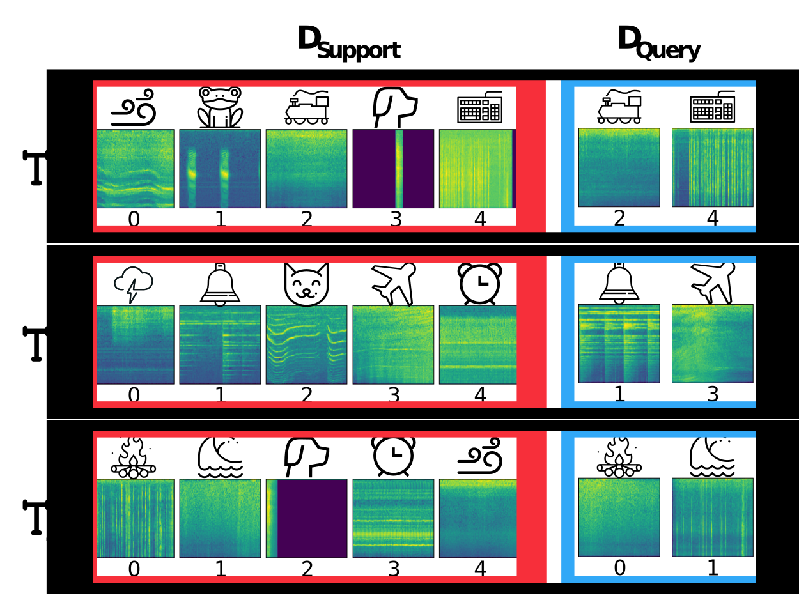

# Few-Shot Classification for Acoustic Signals Codebase
A brand new evaluation suite for a variety of few-shot acoustic classification tasks. 

This is an active codebase in that we will be using and updating it alongside our primary research work behind he scenes. Each release of a new work will likely see an update or new branch of this evaluation suite. 


## News & Updates
 - 9/8/23: Public release of the codebase 


## Citation
This codebase was developed for our most recent works [MT-SLVR](https://github.com/CHeggan/MT-SLVR) and [MetaAudio](https://github.com/CHeggan/MetaAudio-A-Few-Shot-Audio-Classification-Benchmark). If you find this repo useful or utilise it in your work, please consider citing our works:

```
@misc{heggan2023mtslvr,
      title={MT-SLVR: Multi-Task Self-Supervised Learning for Transformation In(Variant) Representations}, 
      author={Calum Heggan and Tim Hospedales and Sam Budgett and Mehrdad Yaghoobi},
      year={2023},
      eprint={2305.17191},
      archivePrefix={arXiv},
      primaryClass={cs.LG}
}
```

```
@InProceedings{10.1007/978-3-031-15919-0_19,
author="Heggan, Calum
and Budgett, Sam
and Hospedales, Timothy
and Yaghoobi, Mehrdad",
title="MetaAudio: A Few-Shot Audio Classification Benchmark",
booktitle="Artificial Neural Networks and Machine Learning -- ICANN 2022",
year="2022",
publisher="Springer International Publishing",
pages="219--230",
isbn="978-3-031-15919-0"
}
```


# Few-Shot Evaluation
In this framework we evaluate over few-shot classification tasks, each containing a support set and a query set. These are best though about as mini learning problems in the regime where you have limited labelled data. The support set is effectively a mini-training set, which we use to train a classifier, and the query set acts as analogously to a tests set. 




In simplified code: For each pre-trained model and each considered dataset, the evaluation framework does the following:
```python 
# Consider some number n of few-shot classification tasks, we use n = 10,000
for _ in range(num_few_shot_tasks):
    # Sample new fs task function grabs a new support and query set making a new task
    x_support, y_support, x_query, y_query = sample_new_fs_task()
    # Generate feature embeddings for both our supports and queries using our frozen model
    sup_feats = model(x_support)
    quer_feats = model(x_queries)

    # Train our classifier on the support features
    classifier.train(sup_feats, y_support)

    # Test our trained classifier on our queries
    task_accuracy = classifier.test(quer_feats, y_query)

# We then average over all of the individual task accuracies for this dataset and model combination in order to obtain a mean and std/CI
```


# Using the Repo
## Contents & Variables
The evaluation suite contains a variety of options for more advanced evaluation:
 - Generalised neural network plugin: 


## Environment


## Datasets & Processing
validation/test


## Additional Setup
There are a few blank folders to be added to the main repo folder:
 - "TRAINED": The folder which will contain the trained models we want to evaluate over
 - "RESULT FILES": Folder to contain the results of the few-shot eval run

Within "TRAINED", unless using a single model, models will have to be nested within additional folders. Our code utilises a model loop where any model within a given directory will be loaded and evaluated sequentially. This process is great for mass evaluation with similar model types (architecture/adapter/input etc) but can lead to errors if not handled properly.

## Example Run


# Functionality
## Variable Length Handling
Our evaluation datasets range from fixed length (where all samples are exactly the same size) to massively variable length (where samples range from 0.1 seconds to multiple minutes). 

To handle this we build the framework around the idea of variable representation length, where effectively given an input sample, we can choose how long it should be as input to the model. We implement this idea using the following constraints:
 - Any sample from any dataset can have its input length modified
 - If a sample is to be extended, it is circularly padded
 - If a sample is longer than what we want, we split it up into sections that are wanted length and randomly sample from them

All representation length changes are done before conversion to spectrograms if applicable.

## Input Data Dimensionality
The codebase offers 3 different data input representations for models:
 - Raw 1d signal (dims=1, channels=1)
 - 2d 1-channel typical Mel-Spectrogram (dims=2, channels=1)
 - 2d 3-channel Mel-Spectrogram w/ channels 2 and 3 containing explicit phase and amplitude information (dims=2, channels=3)

## Main Model Loop
As the evaluation framework is largely built around the purpose of mass model evaluation, we utilise an inner loop for both available models and considered datasets. Tis comes with a few benefits and a few possible drawbacks. 

Benefits:
 - Allows many models to be evaluated over many datasets with a single script run

Drawbacks:
 - Models that are to be evaluated in a single script run must be of similar type, i.e same input type/base model architecture
 - If running single models, they have to be nested inside a folder

As of now, our code primarily supports resnet based architectures. If you want to use a base neural model that is different you will have to do the following:
 - Add the model construction scripts to the "Models_" folder
 - Modify the encoder selection script to include your model
 - Modify the setup.py script to include loading your model based on some input name

## Conversion to Features 
Sampling many tasks from datasets and extracting/evaluating them sequentially can be very expensive, i.e 20 minutes for a single set of 10,000 tasks for a single model. To alleviate this issue we implemented a feature extraction pipeline within the evaluation code. Effectively what this section does  

## Types of Tasks
hard/easy etc


Frame it as a blend between the current eval codebase and the vv codebase. We only perform evaluation, there is no training or fine-tuning here.

Have a trained models folder that we loop over (similar as is found in FS eval codebase)

Generate a compiled set of features and labels (like in vv)

Use mostly same code from vv after that


Still to do:
 - variable length sklin classifier
 - obtain metrics for accuracies (std etc)
 - bundle difficulty results
 - proper speed testing
 - output to file